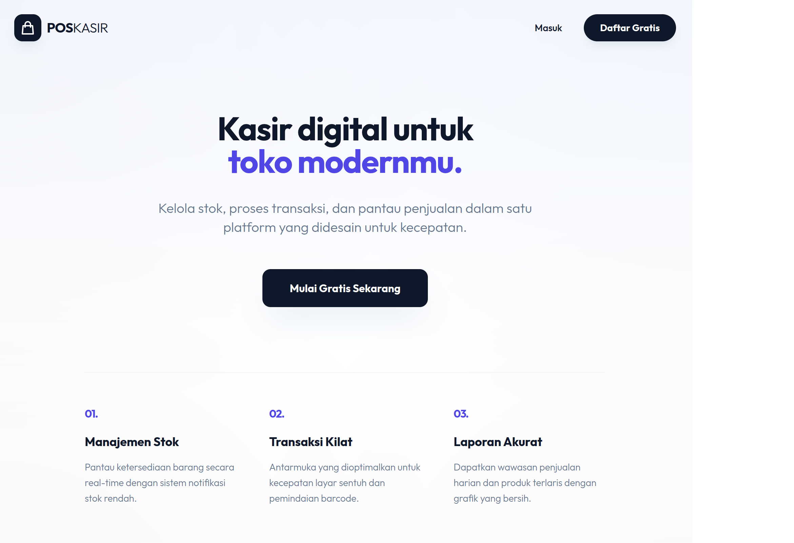
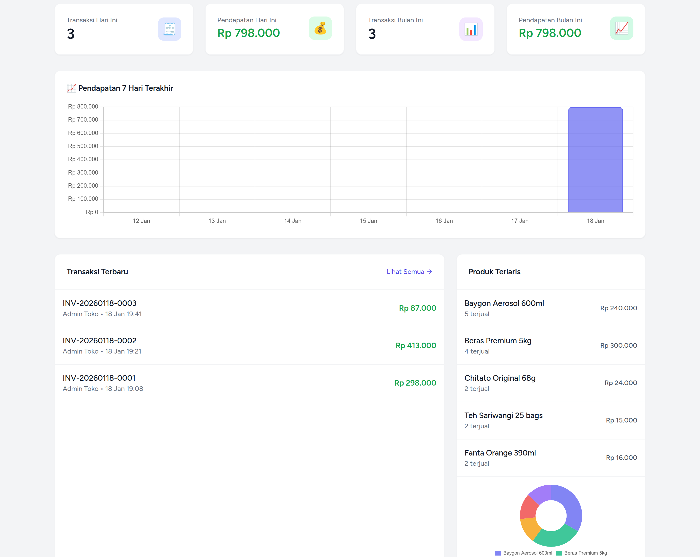
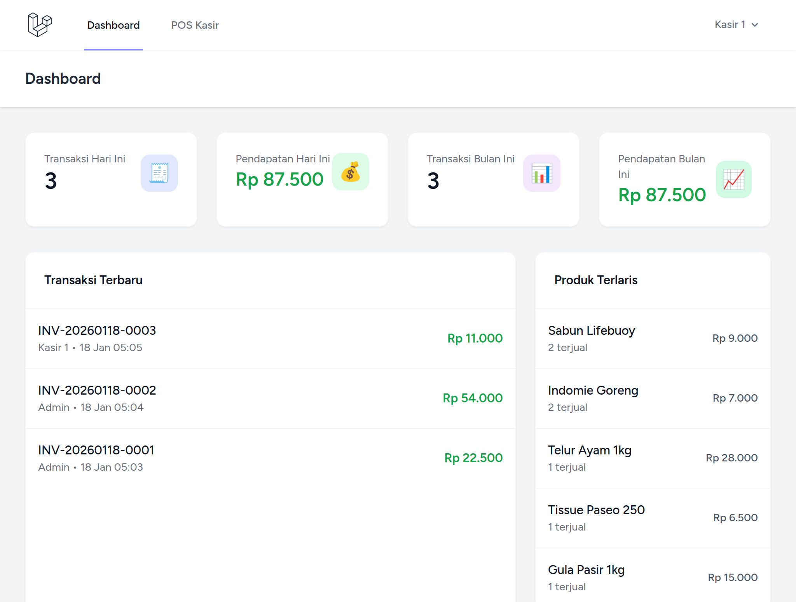

<div align="center">

# 🛒 POS KASIR MU

**Solusi Kasir Pintar, Modern, dan Cepat untuk UMKM & Retail**

[](https://laravel.com)
[](https://php.net)
[](https://tailwindcss.com)
[](https://alpinejs.dev)
[](LICENSE)

POS KASIR MU adalah aplikasi Point of Sale (POS) berbasis web yang dirancang untuk membantu pengusaha UMKM mengelola transaksi, stok barang, hingga laporan keuangan dengan cara yang sangat mudah dan profesional.

[Fitur Utama](#-fitur-utama) • [Teknologi](#-teknologi) • [Instalasi](#-instalasi-cepat) • [Dokumentasi Lengkap](DOKUMENTASI.md)

</div>

---

## ✨ Fitur Utama

Aplikasi ini dilengkapi dengan fitur-fitur esensial yang sudah teruji untuk operasional toko harian:

- 🚀 **Point of Sale (POS) Cepat**: Interface kasir yang responsif, mendukung Scan Barcode, dan Quick Cash buttons (Uang Pas, 50k, 100k).
- 📦 **Inventori & Stok**: Manajemen produk lengkap dengan harga beli (modal), harga jual, stok otomatis, dan sistem _trash_ (soft delete).
- 📊 **Dashboard Analytics**: Lihat omzet harian, grafik penjualan mingguan, dan peringatan stok menipis secara real-time.
- 💰 **Laporan Laba Rugi**: Hitung keuntungan bersih secara otomatis berdasarkan perbandingan harga beli dan harga jual.
- 🧾 **Struk Thermal & Thermal Ready**: Format struk yang dioptimalkan untuk printer thermal (58mm/80mm).
- ⚙️ **Pengaturan Toko Dinamis**: Ubah nama toko, alamat, dan pesan struk langsung dari dashboard tanpa sentuh kode program.
- 📥 **Export Data**: Export semua data (Produk, Transaksi, Laporan, Log) ke format CSV/Excel dengan sekali klik.
- 🔔 **Notifikasi Stok Rendah**: Peringatan otomatis saat stok produk menipis via email/database.
- 💾 **Backup & Restore**: Backup database otomatis dengan kompresi (gzip) dan restore mudah.
- 🔐 **Audit & Security**: Activity Log, Rate Limiting, Pessimistic Locking, dan Cache Management untuk keamanan transaksi.
- ⚡ **Optimized Performance**: N+1 query protection, eager loading, dan cache system untuk performa tinggi.

---

## 📸 Tampilan Aplikasi

<div align="center">

<br>

<br>

</div>

---

## 🛠 Teknologi

Dibangun dengan stack teknologi modern untuk performa dan skalabilitas:

- **Core**: PHP 8.5 & Laravel 12
- **Frontend**: Blade Templating, Tailwind CSS v4, Alpine.js
- **Database**: MySQL / MariaDB
- **Validation**: Form Requests API
- **Security**: Rate Limiting, Pessimistic Locking, Activity Logging, Cache Management
- **Architecture**: Repository & Service Pattern (Clean Architecture)
- **Testing**: Laravel Factories & Seeders untuk data testing realistis

---

## 🚀 Instalasi Cepat

Ikuti langkah berikut untuk menjalankan aplikasi di server lokal Anda:

### 1. Persiapan

Pastikan Anda sudah menginstall **PHP 8.2+**, **Composer**, dan **Node.js**.

### 2. Clone & Install

```bash
git clone https://github.com/Smeagol03/PosKasir.git
cd PosKasir
composer install
npm install
```

### 3. Konfigurasi

```bash
cp .env.example .env
php artisan key:generate
```

_Jangan lupa atur database di file `.env`._

### 4. Database & Assets

```bash
# Opsi 1: Database Bersih (Production Ready)
php artisan migrate
php artisan db:seed

# Opsi 2: Database dengan Data Demo Lengkap (Recommended untuk Testing)
php artisan migrate:fresh --seed --class=DemoSeeder

# Build Frontend
npm run build
```

### 5. Jalankan Server

```bash
# Development server
php artisan serve

# Akses di browser
http://localhost:8000
```

---

## 👤 Akun Default

### **Production (DatabaseSeeder)**

| Akun              | Email             | Password   |
| ----------------- | ----------------- | ---------- |
| **Administrator** | `admin@admin.com` | `password` |

### **Demo (DemoSeeder)**

| Akun              | Email             | Password   |
| ----------------- | ----------------- | ---------- |
| **Administrator** | `admin@demo.com`  | `password` |
| **Kasir Pagi**    | `kasir1@toko.com` | `password` |
| **Kasir Siang**   | `kasir2@toko.com` | `password` |
| **Kasir Sore**    | `kasir3@toko.com` | `password` |

> ℹ️ **DemoSeeder** sudah termasuk: 30 produk realistis, ~60 transaksi history 7 hari, stock adjustments, dan 5 produk low stock untuk testing notifikasi.

---

## 🎛️ Artisan Commands

Aplikasi menyediakan commands khusus untuk manajemen toko:

### **Inventory Management**
```bash
# Cek stok rendah & kirim notifikasi ke admin
php artisan inventory:check-low-stock --threshold=10
```

### **Backup & Restore**
```bash
# Backup database (compressed)
php artisan backup:database

# List semua backup
php artisan backup:list

# Restore dari backup
php artisan restore:database backup_2026-04-13_10-30-00.sql.gz
```

### **Cache Management**
```bash
# Bersihkan expired cache
php artisan cache:clear-expired
```

> 💡 **Tips**: Setup Laravel Scheduler di cron untuk menjalankan commands otomatis. Lihat [DOKUMENTASI.md](DOKUMENTASI.md) untuk panduan lengkap.

---

## 📁 Struktur Kode

Aplikasi ini mengikuti pola **Clean Architecture**:

- `app/Repositories`: Menangani akses data langsung ke database dengan eager loading optimization.
- `app/Services`: Menangani logika bisnis (perhitungan, validasi kompleks).
- `app/Http/Controllers`: Menghubungkan request ke Service.
- `app/Models`: Eloquent models dengan relationships dan factories.
- `app/Console/Commands`: Custom artisan commands untuk backup, inventory, cache.
- `database/factories`: Factory classes untuk testing (User, Product, Transaction).
- `database/seeders`: Seeders untuk production dan demo data.
- `resources/views`: Tampilan UI yang bersih dengan Tailwind & Alpine.

---

## 🧪 Testing dengan Factories

Aplikasi dilengkapi **factories lengkap** untuk testing:

```php
// Buat produk dengan state
Product::factory()->lowStock()->create();
Product::factory()->highStock()->create();

// Buat transaksi dengan items
$transaction = Transaction::factory()->today()->create();
TransactionItem::factory(3)->forTransaction($transaction)->create();

// Buat user spesifik
User::factory()->admin()->create();
User::factory(5)->kasir()->create();
```

Lihat [DOKUMENTASI.md](DOKUMENTASI.md) untuk panduan lengkap factories.

---

## 📖 Dokumentasi Teknis

Untuk penjelasan mendalam mengenai:
- **ERD Database** & relasi tabel
- **Clean Architecture** & design patterns
- **N+1 Query Protection** & performance optimization
- **Sistem Keamanan** (Rate Limiting, Locking, Cache)
- **Panduan Development** & best practices
- **Factories & Seeders** lengkap

👉 **[DOKUMENTASI.md](DOKUMENTASI.md)**

---

## 🛡️ Performance Optimizations

Aplikasi sudah dioptimasi untuk production:

✅ **N+1 Query Protection** - Eager loading di semua repository  
✅ **Batch Notifications** - Notifikasi stok rendah efisien  
✅ **Cache Management** - Setting cache untuk mengurangi query DB  
✅ **Optimized Queries** - GROUP BY untuk statistik, JOIN untuk reports  
✅ **Database Indexing** - Fast lookup untuk barcode & invoice code  

---

<div align="center">

**[Pos Kasir Mu]** - _Solusi Digital untuk Bisnis Anda_

Dibuat dengan ❤️ oleh [Alpiant](https://github.com/Smeagol03)

</div>
